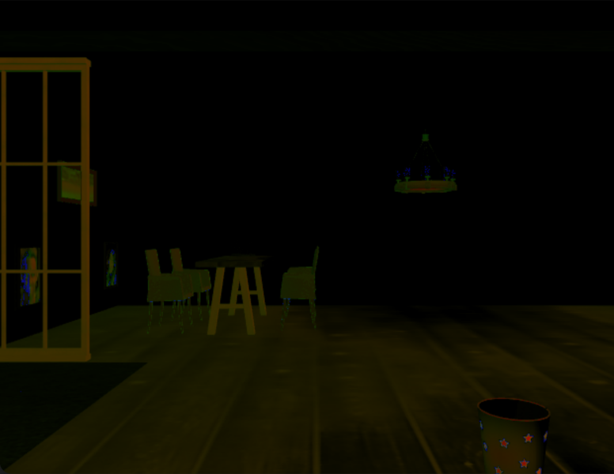
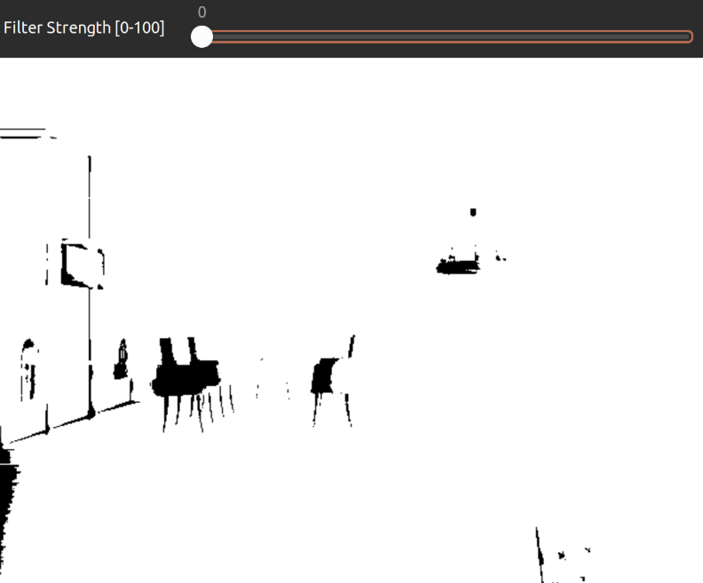
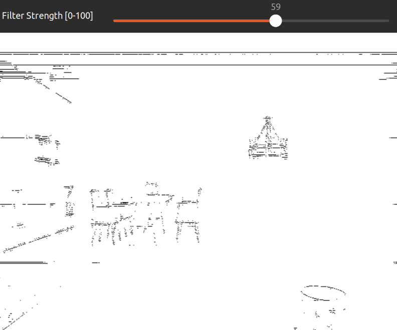
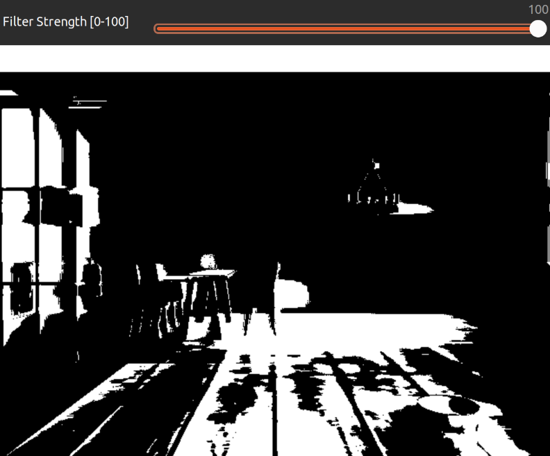
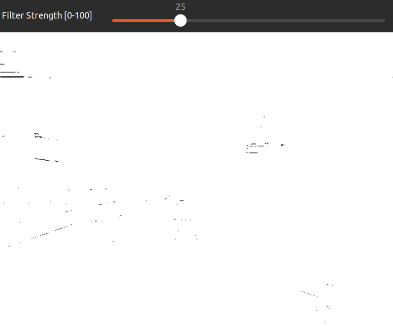

[](https://classroom.github.com/a/6bfcAzJo)
[](https://classroom.github.com/online_ide?assignment_repo_id=13786595&assignment_repo_type=AssignmentRepo)
# Práctica 1 – Espacios de color y DFT


[](https://github.com/jmguerreroh/computer_vision/actions/workflows/master.yaml)

This package is recommended to use with the [TIAGO](https://github.com/jmguerreroh/tiago_simulator) simulator.

# Run

Execute:
```bash
ros2 launch practica1-grupo5 cv.launch.py
```
If you want to use your own robot, in the launcher, change the topic names to match the robot topics.

# Questions

- Adjunta una captura de la opción 2, e indica el por qué se ven esos colores en la
imagen resultado de la resta entre HSV y HSI.


Para poder saber el porque de los colores resultantes es necesario conocer las diferencias entre HSV y HSI, para ello vamos a ver las diferencias entre los canales.

- El canal H o el tono se calcula de una manera más o menos similar entre los 2, por lo tanto las únicas diferencias que existan serán por la precisión de los calculos.
- El canal S o la saturación es donde empiezan a haber diferencias entre los 2 métodos. En el HSV este valor viene definido por la siguiente fórmula: (max(R,G,B) - min(R,G,B))/max(R,G,B), mientras que para HSI el valor de S viene definido por 1 - min(R,G,B)/((1/3)⋅(R+G+B)). Esta diferencia en el cálculo causa que la imágen resultante tenga partes de color verdoso.
- El canal I o V, o intensidad o valor también tienen diferencias tanto en su cálculo como en su nombre. Para HSV el valor es el máximo de los 3 canales, mientras que para el HSI la intensidad es la media de los mismos. Por esto la imágen tendrá un tono rojizo, ya que la imágen final está en BGR.

Con esto ya podemos explicar porque la imagen tiene esos colores oscuros sobre todo en el fondo blanco, ya que la media de (255,255,255) es igual al valor máximo. Y luego los tonos amarillentos y verdosos se explican por las diferencias de calculo de los canales S y V e I.

- ¿Qué se observa en la imagen resultado de la opción 6 y en qué influye que se varíe el
valor del filtro?

En la imagen resultado de la opción 6 se muestran los bordes de algunos de los objetos más significativos de la imágen.

Cunado el filtro tiene el valor 0, es decir, sin filtro, la imágen resultante solo consiste de los objetos más oscuros de la opción 5.



Mientras que según aumenta el filtro se muestran de manera más clara los bordes de los objetos significativos de la imágen, como las sillas, los cuadros de la pared, la papelera o el candelábro.



Y al tomar el valor del 100%, es decir, con filtro en toda la imágen, la imágen resultante solo consiste de los objetos más oscuros de la opción 4, que generará una imagen más oscura que con el filtro al 0.



También es importante ver que cuando el filtro se encuentra en un valor de un cuarto, la imagen resultante tiende a ser blanca, y no se puede apreciar ningún objeto.


## FAQs:

* /usr/bin/ld shows libraries conflicts between two versions:

Probably you have installed and built your own OpenCV version, rename your local folder:
```bash
mv /usr/local/lib/cmake/opencv4 /usr/local/lib/cmake/oldopencv4
```

## About

This is a project made by Javier Izquierdo and Sebastián Andrés Mayorquín, Students at [Universidad Rey Juan Carlos].

Copyright &copy; 2024.

## License

Shield: 

[![CC BY-SA 4.0][cc-by-sa-shield]][cc-by-sa]

This work is licensed under a
[Creative Commons Attribution-ShareAlike 4.0 International License][cc-by-sa].

[![CC BY-SA 4.0][cc-by-sa-image]][cc-by-sa]

[cc-by-sa]: http://creativecommons.org/licenses/by-sa/4.0/
[cc-by-sa-image]: https://licensebuttons.net/l/by-sa/4.0/88x31.png
[cc-by-sa-shield]: https://img.shields.io/badge/License-CC%20BY--SA%204.0-lightgrey.svg

[Universidad Rey Juan Carlos]: https://www.urjc.es/
